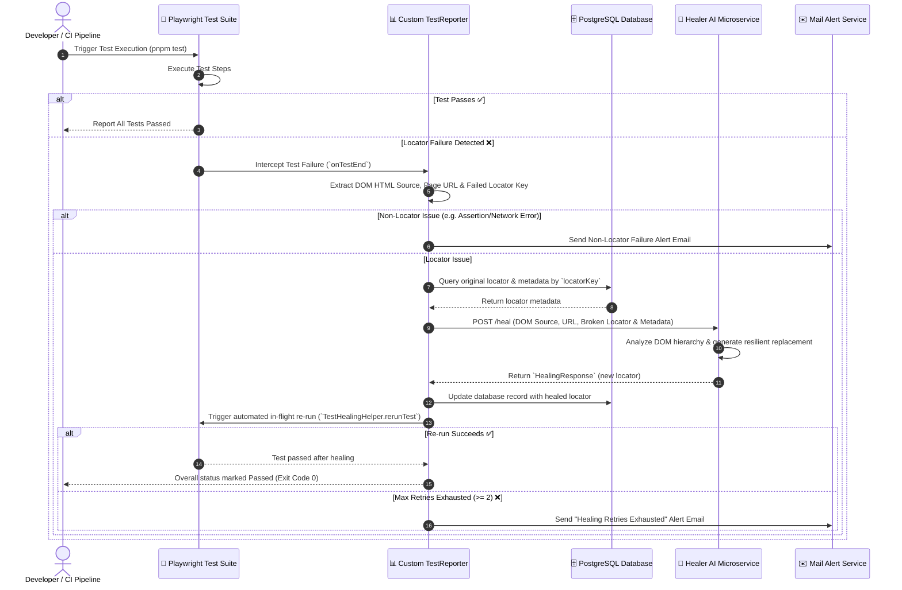

# 🛡️ Self-Healer

> Autonomous AI-powered self-healing test automation framework for Playwright, TypeScript, and Fastify.

---

### 🎯 The Challenge in Modern QA
In fast-paced software development, frontend user interfaces evolve constantly. Design refactors, dynamic CSS class shifts, DOM restructurings, and component library migrations frequently break automated End-to-End (E2E) test suites.

- **High Maintenance Overhead**: QA engineers spend up to **40% of their bandwidth** manually updating fragile element locators (XPaths, CSS selectors, IDs).
- **CI/CD Pipeline Friction**: Broken locators cause false-positive test failures, halting continuous deployment pipelines and delaying production releases.
- **Inflated Engineering Costs**: Traditional test suites require constant human intervention to fix simple UI locator drift.

### 💡 The Self-Healer Solution
**`self-healer`** introduces **autonomous, real-time selector repair** to Playwright test suites. When an E2E test fails due to a broken DOM selector, `self-healer` intercepts the failure, extracts page DOM context, requests a dynamic healed selector from an AI intelligence service, updates the persistent locator registry, and re-runs the test in-flight — delivering zero-downtime, self-repairing test suites.

### 📈 Business & Strategic Highlights
* ⚡ **90%+ Reduction in Test Maintenance**: Automates selector repair without requiring manual developer intervention or PR updates.
* 🛡️ **Unbreakable CI/CD Pipelines**: Prevents pipeline blocks caused by minor UI tweaks, design system changes, or dynamic attribute shifts.
* 🚀 **Accelerated Time-to-Market**: Eliminates test-suite bottlenecks, enabling rapid deployment cycles with high QA confidence.
* 📊 **Smart Failure Differentiation**: Distinguishes true application bugs from simple locator drift — triggering immediate email alerts only for actual functional errors.
* 💰 **High Engineering ROI**: Frees QA and automation teams to focus on complex test scenarios rather than tedious selector upkeep.

### 🧩 Product Ecosystem Architecture
`self-healer` is designed as part of a modular, production-ready microservice architecture. The three core components operate independently yet integrate seamlessly:

1. **`self-healer`** *(This Repository)*: The core test automation execution engine and orchestrator. Manages Playwright test execution, custom failure reporting, DB locator persistence, Fastify API endpoints, dynamic locator resolution, and the auto-rerun execution loop.
2. **`self-healer-ai`**: The dedicated AI microservice. Receives DOM snapshots, page context, and broken locator metadata from `self-healer` to generate optimized, resilient replacements using LLM reasoning.
3. **`self-healer-app`**: The target web application under test (e.g., e-commerce web platform). Serves as the UI interface validated by the automated E2E test suite.

---

## 🛠️ Section 2: Technical Architecture & Developer Guide

### 📐 Technology Matrix

| Component | Technology | Purpose |
| :--- | :--- | :--- |
| **Test Runner** |  | Cross-browser End-to-End automation framework |
| **Language & Runtime** |   | Strictly-typed application codebase & ESM execution |
| **API Server** |  | High-performance HTTP server for test orchestration |
| **Database** |  | Persistent DB storage for locator keys, metadata & healed values |
| **Containerization** |  | Multi-stage production container image built on Playwright Jammy |
| **Package Manager** |  | Fast, disk-space-efficient dependency management |

---

### 🔄 End-to-End Self-Healing Workflow



---

### Key Technical Features

- **Custom Playwright `Reporter` Integration** ([`src/core/reporting/test-reporter.ts`](file:///d:/resource/Projects/self-healer/src/core/reporting/test-reporter.ts)): Intercepts test failures in real-time, inspects console logs for failed locator keys (`LOCATOR_KEY:<key>`), and extracts page attachments.
- **Database-Backed Locator Registry** ([`src/core/db/DBManager.ts`](file:///d:/resource/Projects/self-healer/src/core/db/DBManager.ts)): Manages primary and fallback locators, metadata, and history in PostgreSQL.
- **Decoupled AI Healer Client** ([`src/core/healer-client/healer.client.ts`](file:///d:/resource/Projects/self-healer/src/core/healer-client/healer.client.ts)): Communicates with external `self-healer-ai` via REST HTTP API calls.
- **In-Flight Test Re-run Engine** ([`src/utils/TestHealingHelper.ts`](file:///d:/resource/Projects/self-healer/src/utils/TestHealingHelper.ts)): Spawns isolated Playwright sub-processes to immediately re-verify healed selectors without aborting the entire suite.
- **Automated Mail Alerts** ([`src/services/MailService.ts`](file:///d:/resource/Projects/self-healer/src/services/MailService.ts)): Notifies engineering teams when retries are exhausted or non-locator application bugs occur.

---

### ⚙️ Prerequisites & Environment Variables

Ensure you have the following installed:
* **Node.js**: `v20+`
* **pnpm**: `v11.3.0+`
* **Playwright Browsers**: Chromium, Firefox, WebKit

Create a `.env` file in the project root based on `.env.example`:

```ini
# Execution Mode
HEADLESS=true
PORT=3000

# AI Healing Microservice URL
HEALER_AI_SERVICE_URL=http://127.0.0.1:3001

# Application Under Test (Target URL)
SHOPCO_URL=http://localhost:5173/

# Database Configuration (PostgreSQL / Aiven Cloud)
DB_HOST=your-pg-host.cloud.com
DB_PORT=23523
DB_USER=your_db_user
DB_PASSWORD=your_db_password
DB_NAME=healer
```

---

### 🚀 Getting Started

#### 1. Installation
Clone the repository and install dependencies using `pnpm`:

```bash
pnpm install
```

Install Playwright browsers (if running locally for the first time):

```bash
npx playwright install --with-deps
```

#### 2. Running Tests
Run the Playwright test suite (with self-healing active):

```bash
pnpm test
```

#### 3. Starting the Fastify Automator Service
Launch the API orchestrator service:

```bash
# Development mode (with live reload)
pnpm start

# Production build & start
pnpm run build
pnpm run start:prod
```

#### 4. Code Quality & Linting

```bash
pnpm run lint
```

---

### 🐳 Docker Deployment

The application includes an optimized multi-stage `Dockerfile` based on `mcr.microsoft.com/playwright:v1.60.0-jammy`.

#### Build Docker Image:

```bash
docker build -t self-healer:latest .
```

#### Run Container:

```bash
docker run -d \
  -p 3000:3000 \
  --env-file .env \
  --name self-healer-app \
  self-healer:latest
```

---

## 📄 License

This project is open-source and licensed under the [ISC License](file:///d:/resource/Projects/self-healer/LICENSE).
